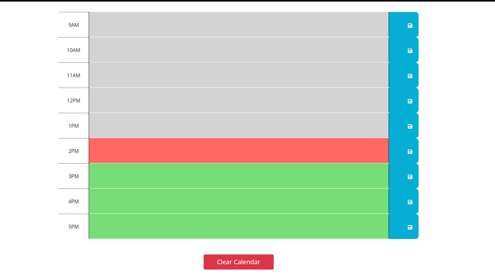
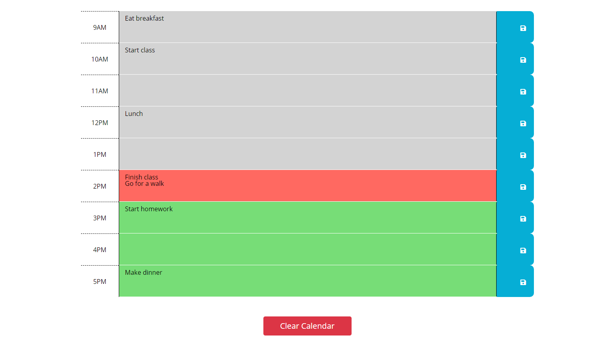
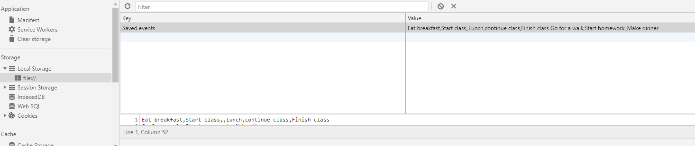
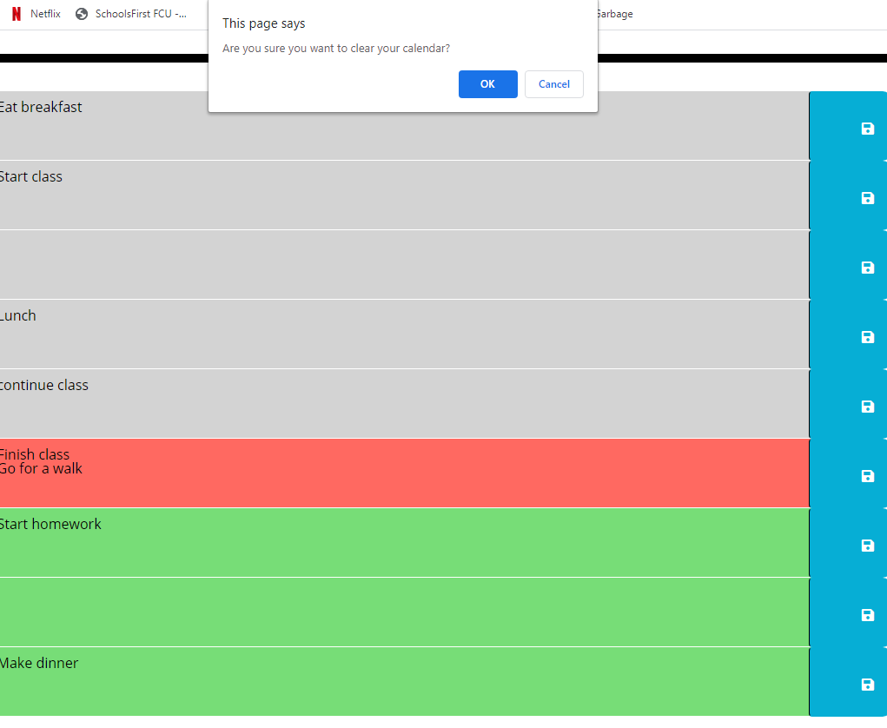

# work-day-planner
Description
================================================================================
This is a simple day planner I have made that can:
*Detect the date and time and use that data to change the date displayed and the background color of each hour on the planner. 
*Save input text in each text area and when refreshed, show the inputted data in the same text area. 

The HTML and CSS for the page were pre-made, but I added and styled a button to clear the calendar. 

The JavaScript was written entirely by me, and uses local storage and an array to store user-submitted items so that it persists through refreshes. The clear button asks the user if they're sure they want to clear the calendar, and if confirmed resets the array to its original state and re-renders the page so the calendar is empty.

Links
================================================================================
Deployed site: https://jjbidwell.github.io/work-day-planner/
Github repository: https://github.com/jjbidwell/work-day-planner

screenshots: 
 Empty calendar:

Filled-out calendar: 

Data saved in local storage: 

Clear confirmation: 

